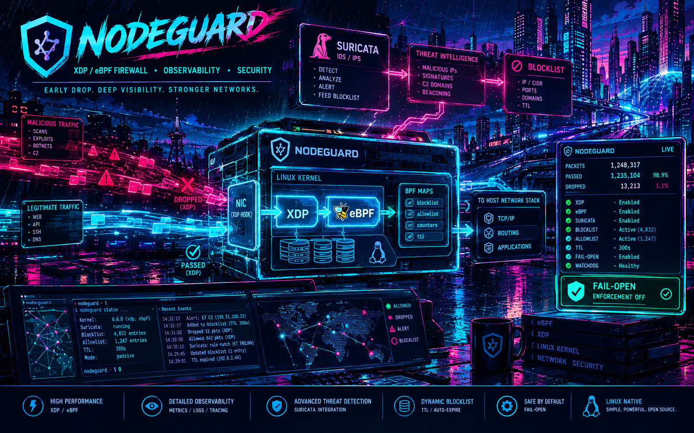

# nodeguard



An eBPF/XDP firewall with Suricata IPS wiring for small Linux gateways
(Fedora 44, stock packages only). Suricata detects passively; a ~200-line
custom XDP program blocks confirmed attackers at the driver, with in-kernel
TTL expiry and fail-open behaviour everywhere:

- No program attached, empty maps, dead responder, dead Suricata: traffic
  flows. The only drop is an unexpired blocklist hit.
- Anti-spoofing gate: automated blocks require a severity-1 alert on a TCP
  flow with bidirectional flow evidence; a blind spoofed packet can never
  insert a block. UDP/ICMP alerts are log-only unless a SID is promoted by
  hand with a written justification.
- A watchdog probes allowlisted lifelines AND a deliberately
  non-allowlisted canary, so both total datapath death and over-blocking
  are detected; either soft-disables enforcement via a hitless kill switch.
- The allowlist (never-blockable ranges, your DNS resolvers, your remote
  egress IPs, tailscale DERP relays) is enforced in-kernel, before the
  blocklist, and the host's live WireGuard port is hard-passed so a block
  can never sever the management tunnel.

See [docs/design.md](docs/design.md) (arc42) for the architecture,
failure-mode table, phased install plan, and rollback; decisions are
recorded in [docs/adr/](docs/adr/), behaviour specs under
[openspec/](openspec/), and history in [CHANGELOG.md](CHANGELOG.md).

## Layout

```
src/nodeguard_kern.c        the XDP program (single source of map truth)
bin/                        ngmap.py (all map encoding), CLIs, daemons
units/                      systemd units and timers
etc/                        shared config (protected.conf, sids.conf)
hosts/example-gateway/      template per-host config (documentation IPs)
tests/                      stdlib unit suite (no root, network, or bpftool)
build/build.sh              container build + netns rehearsal + spec + yaml
build/suricata-stock.yaml   stock yaml kept for drift comparison
build/suricata-stock.version  the RPM NVR that stock yaml came from
deploy/deploy.sh            file push + verify-before-install; enables nothing
```

Real deployments keep their per-host config directories (interfaces,
allowlists, HOME_NET) in a private overlay outside this repository and pass
the directory to `deploy.sh`. Never commit real addresses or network layout
here.

## Build

On any Fedora 44 x86_64 machine with docker or podman (never on the
production hosts; no compiler lands there):

```
docker run --rm --privileged -v "$PWD:/work" fedora:44 /bin/bash /work/build/build.sh
```

Outputs land in `build/out/`: `nodeguard_kern.o`, `nodeguard-maps.spec`
(generated from the object; the maps service refuses drift),
`nodeguard_kern.o.sha256` (compared by `deploy.sh`, not eyeballed),
`nodeguard_kern.o.buildinfo`, and a `suricata.yaml` per host config dir
(`HOSTS_DIR=` selects a private overlay). The rehearsal step attaches the
object in a netns against pre-created pins and fails the build on any
verifier or pin-reuse problem.

### Pinning the builder image

`fedora:44` is a floating tag, so the command above records nothing about
what compiled the object. Resolve the digest on the build host, pass it in,
and run the image by digest:

```
IMAGE_DIGEST="$(docker inspect --format '{{index .RepoDigests 0}}' fedora:44)"
docker run --rm --privileged -v "$PWD:/work" -e IMAGE_DIGEST="$IMAGE_DIGEST" \
    fedora@"${IMAGE_DIGEST#*@}" /bin/bash /work/build/build.sh
```

`build/out/nodeguard_kern.o.buildinfo` is the audit trail: build time, git
commit, base image digest, `clang --version`, and the toolchain RPM NVRs,
with `unknown` written for anything the container could not determine
(`IMAGE_DIGEST` unset, no git metadata on the mount). Refresh the pin
deliberately; the RPM NVRs remain the fallback provenance when the pin is
skipped. This records **provenance, not reproducibility**: two builds of
the same commit may produce different bytes, and the buildinfo file is what
makes such a difference explainable.

## Deploy and bring-up

```
bash deploy/deploy.sh admin@gateway.example.net /path/to/private/hosts/gateway
```

That pushes files only; nothing is enabled or started. Bring-up is phased
and manual, per docs/design.md: 0 prep, 1 Suricata shadow, 2 monitoring
gate + first attach (scheduled: the first native XDP attach on ixgbe blips
the link), 3 responder dry-run, 4 enforcement, 5 steady state.

## Monitoring

The watchdog exports a `nodeguard-status --kv` snapshot to
`/run/nodeguard/nodeguard.kv` every minute; the Zabbix agent reads that file
through the shipped UserParameter (SELinux keeps the agent from calling
`bpf()` itself), the template in `templates/` turns the keys into items
and triggers, and three dashboards sit on top: Overview (attached,
enforcing, healthy right now), Security (scan and attack pressure, and
whether the pipeline is or would be responding), and Capacity and
Pipeline (what fills up or goes stale before morning). The dashboards and
template are generated from `zbx/` (proposed in OpenSpec change
`add-nodeguard-telemetry`) and address hosts through a Zabbix host group,
so adding a gateway is: install nodeguard, link the template, add the
host to the group; no widget rework. `docs/legend.html` explains every
panel.

## The 2am commands

```
nodeguard-status            everything on one screen (--kv for monitoring)
nodeguard-off / -on         hitless enforcement kill switch
nodeguard-list              active blocks with TTL and hit counts
nodeguard-unblock <ip>      immediate unblock
systemctl stop nodeguard-xdp    detach the datapath entirely (link blip)
```

Never attach XDP on a nodeguard host with `ip link`; everything goes
through the libxdp dispatcher. Never use `xdp-loader unload --all` outside
the documented last-resort rollback.

## License

MIT (see [LICENSE](LICENSE)), with one exception: the XDP program
`src/nodeguard_kern.c` and its compiled object are GPL-2.0
(see [LICENSE.GPL-2.0](LICENSE.GPL-2.0)), because it calls GPL-only kernel
BPF helpers and must declare a GPL license for the kernel to load it. All
userspace tooling, scripts, dashboard generators, and documentation are MIT.
See [NOTICE](NOTICE) for the full statement.
